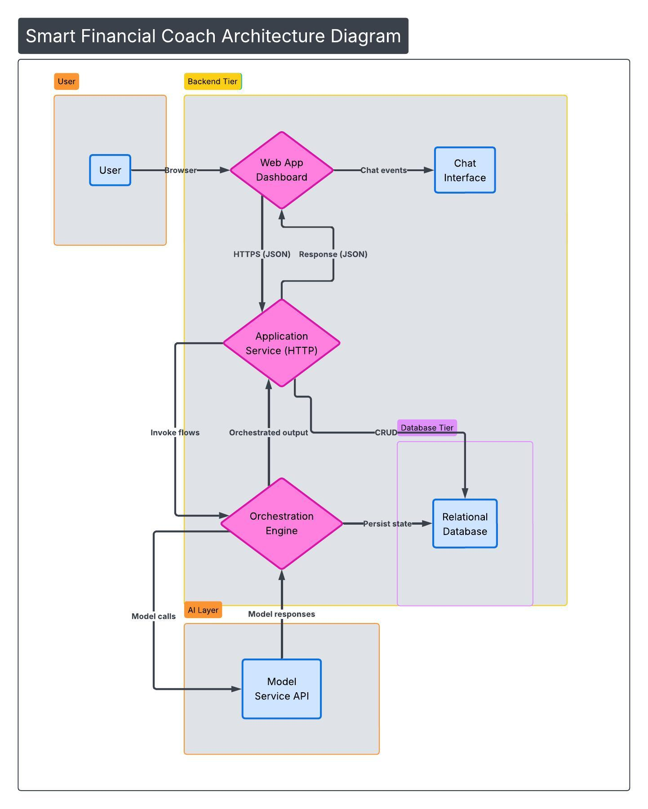

# Smart Financial Coach

An AI-powered personal finance assistant that helps you track spending, visualize habits, and receive personalized financial advice.



## 📺 Video Solution

[Watch the solution video here](https://drive.google.com/file/d/1LB1HUPSNlr9qWYhr2mprNcWSUo3zBdoj/view?usp=sharing)

## 🚀 Quick Start

### Prerequisites

- [Docker](https://www.docker.com/) and Docker Compose
- Google Gemini API Key (Get one at [Google AI Studio](https://aistudio.google.com/))

### Setup

1. **Clone the repository**

   ```bash
   git clone <repository-url>
   cd financial_coach
   ```

2. **Configure Environment Variables**

   ```bash
   cp .env.example .env
   ```

   Edit `.env` and add your `LLM_API_KEY` (Gemini API Key).

3. **Start the Application**

   ```bash
   docker-compose up -d
   ```

   This will start the PostgreSQL database, the FastAPI backend, and the React frontend.

4. **Seed the Database**
   The application needs demo data to be useful. Run the seeder:

   ```bash
   docker-compose exec backend uv run python -m coach.seeder
   ```

   _Note: After seeding, it's recommended to restart the backend to ensure the AI agent picks up the new data correctly:_

   ```bash
   docker-compose restart backend
   ```

5. **Access the App**
   - **Frontend**: [http://localhost:5173](http://localhost:5173)
   - **Backend API**: [http://localhost:8000](http://localhost:8000)
   - **API Docs**: [http://localhost:8000/docs](http://localhost:8000/docs)

## 🏗️ Architecture

- **Frontend**: React 19 + Vite + Tailwind CSS 4. A sleek, responsive dashboard and chat interface.
- **Backend**: FastAPI (Python). Orchestrates the AI agent and provides data to the frontend.
- **AI Agent**: Built with LangGraph and Google Gemini. It can query your financial data using SQL tools.
- **Database**: PostgreSQL. Stores transactions, user goals, and AI insights.

## 🛠️ Development

### Backend Commands

```bash
# View logs
docker-compose logs -f backend

# Run tests (if available)
docker-compose exec backend pytest

# Reset database (Careful!)
docker-compose down -v
docker-compose up -d
```

### Frontend Commands

```bash
# Navigate to frontend directory
cd frontend

# Install dependencies locally (optional, for IDE support)
npm install

# Run dev server locally (points to localhost:8000)
npm run dev
```

## 📄 Documentation

- [Design Document](DESIGN_DOC.md): Detailed overview of the project's design and tech stack.
- [Frontend README](frontend/README.md): Details about the React application.

## ⚖️ License

This project is licensed under the MIT License - see the [LICENSE](LICENSE) file for details.
